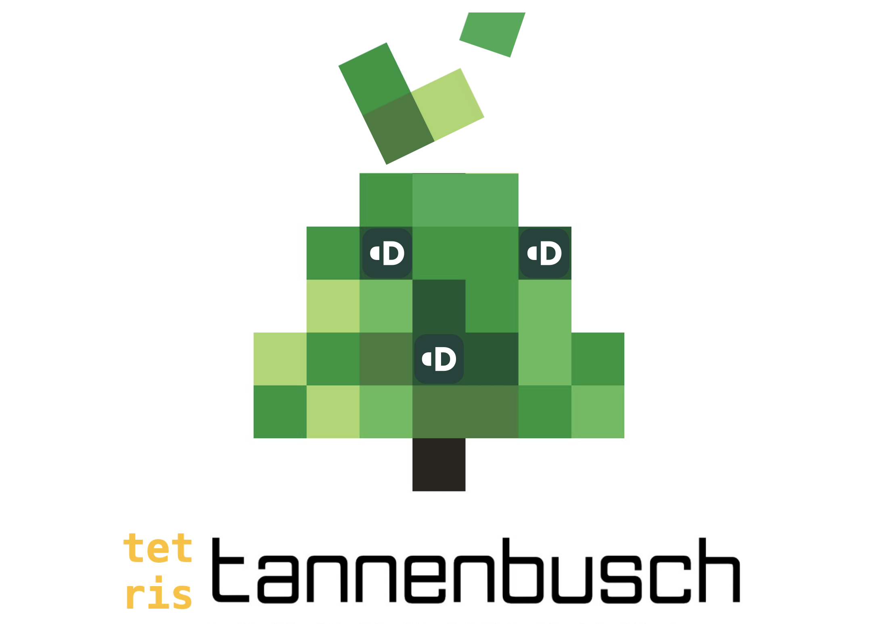
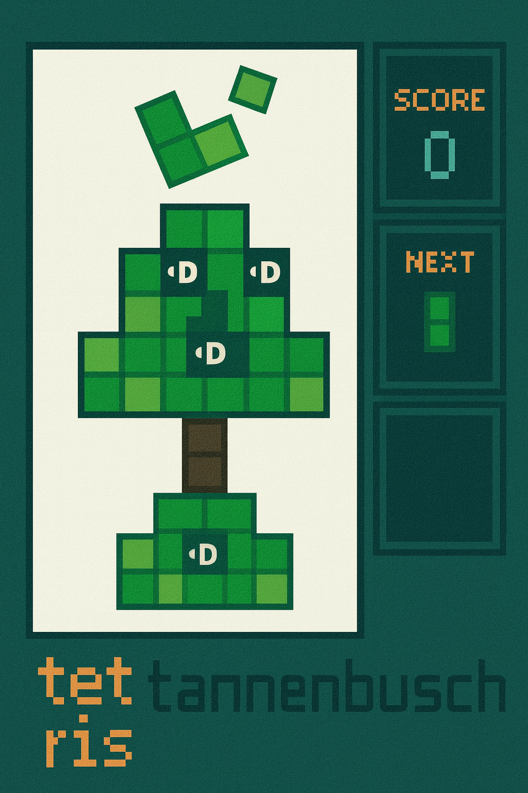

# Tetris tannenbusch



A polished Tetris implementation built with Flutter for macOS and iOS, themed to match the “tannenbusch” poster style. It features a framed board, sidebar panels for score and next preview, and branded badges on dark tiles.



## Features
- Classic Tetris gameplay with 7 tetrominoes and rotations
- Level-based speed, scoring, and line clearing
- Sidebar UI with `SCORE` and `NEXT` preview
- Poster-inspired colors and framed board
- Branded “•D” badge rendered on dark squares
- Keyboard controls on macOS and touch controls on iOS
- Hot reload for rapid iteration

## Controls
- macOS keyboard:
  - Left/Right: move
  - Down: soft drop
  - Up or `Z`: rotate
  - Space: hard drop
  - Code: `_onKey` in `lib/main.dart:159`
- iOS touch:
  - On-screen buttons for move, rotate, drop (visible on non-macOS)

## Run
- Prerequisites: Flutter SDK installed and a recent Xcode for macOS/iOS builds
- Install dependencies:
  ```
  flutter pub get
  ```
- macOS:
  ```
  flutter run -d macos
  ```
  If the app doesn’t foreground, open it directly:
  ```
  open build/macos/Build/Products/Debug/Tetris\ tannenbusch.app
  ```
- iOS simulator:
  ```
  xcrun simctl boot <SIMULATOR-UDID>
  flutter run -d <SIMULATOR-NAME>
  ```

## Project Structure
- `lib/main.dart` — game logic, UI, painters
  - Board painter: `lib/main.dart:271–299`
  - Next preview painter: `lib/main.dart:309–342`
  - Piece definitions and colors: `lib/main.dart:318–360`
- `pubspec.yaml` — Flutter config and assets
- `assets/logo.png` — logo shown in app and README

## Notes
- Assets are declared under `flutter.assets` in `pubspec.yaml`; place custom images in `assets/`.
- The design uses an off‑white board with dark grid and a teal background to mirror the reference poster.

## License
This project is provided as-is for personal and educational use.
